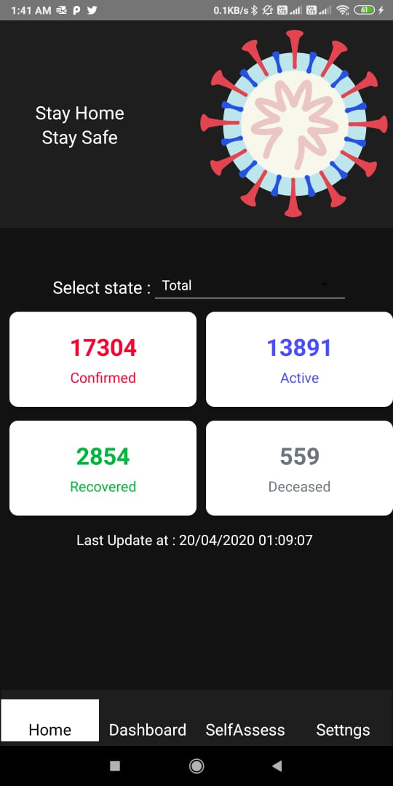
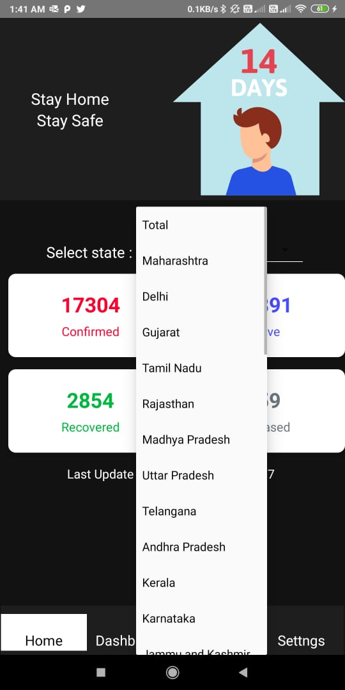
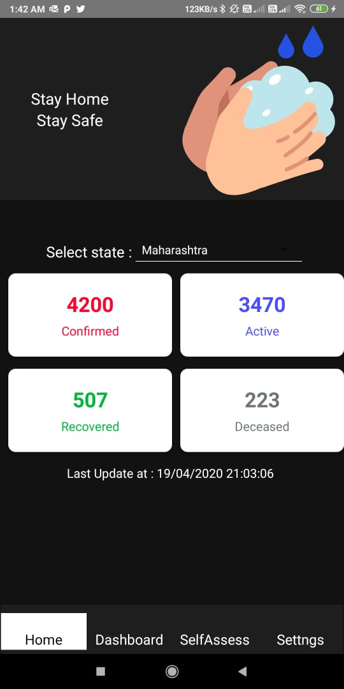
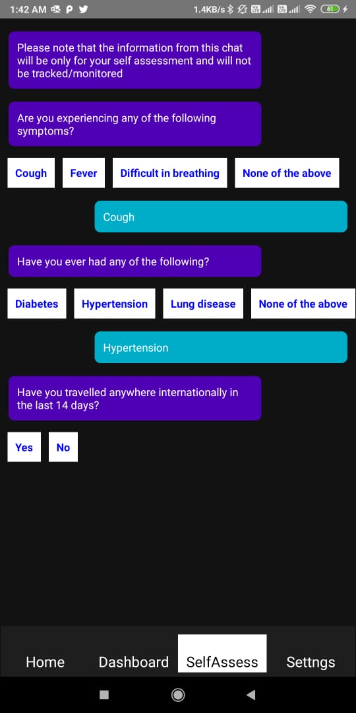
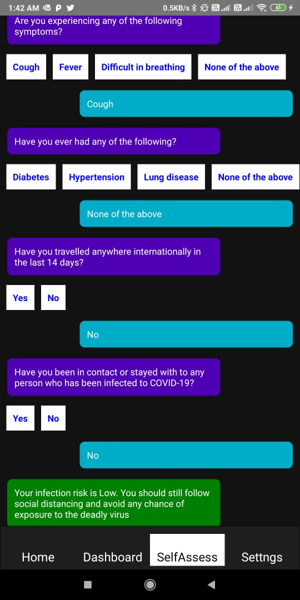
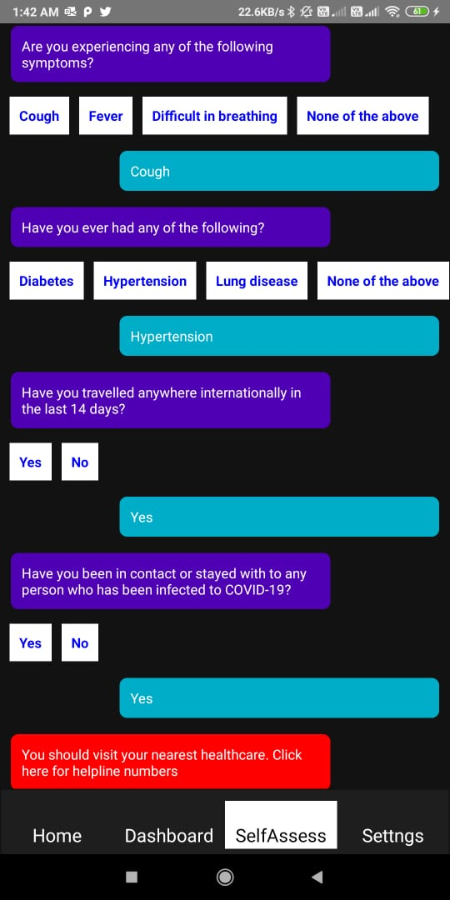

# covidTracker
Stay Informed about the deadly virus and self assess yourself

<b>npm run android<b>
  
<b>npm start<b>

Thats all you need to do to run this application.  

<i><b>Screenshots:</b></i> 
 

